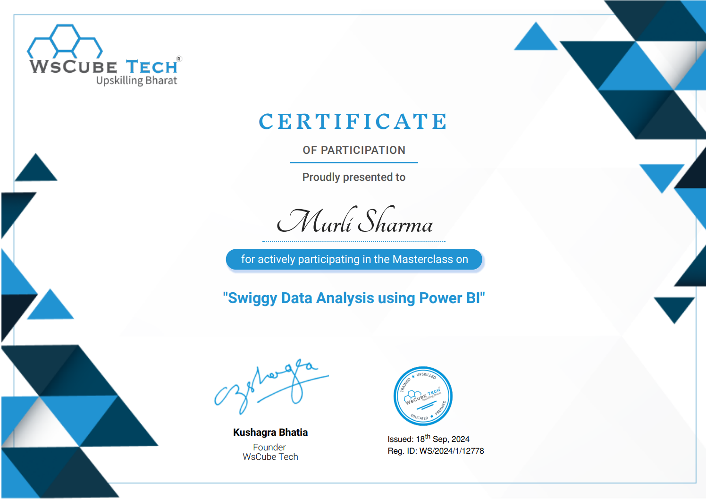

# Swiggy-Data-Analysis

  
  

SWIGGY-DATA-ANALYSIS-PROJECT-USING-POWER-BI

Analyze Swiggy's dataset using Power BI to uncover key insights, trends, and patterns in food delivery operations.

Swiggy Data Analysis: 

Certificate of Completion

This is to certify that Murli Sharma has successfully completed the Swiggy Data Analyst Project. This project involved analyzing extensive data from Swiggy to extract insights, optimize routes, and enhance customer experience using tools such as Python, SQL, and data visualization With Power-BI.

Project Highlights:

Analyzed operational and transactional data.
Extracted insights to boost efficiency.
Leveraged data-driven strategies to improve service quality.

# Swiggy-Data-Analysis

As part of the Data Analytics team at Swiggy, you have been tasked by your manager to analyze key aspects of the company’s order and delivery performance. Using Power BI, your goal is to derive actionable insights to enhance customer satisfaction, streamline delivery operations, and optimize restaurant partnerships. You are required to address the following key business questions.

Total Revenue by Restaurants:
Calculate the total revenue generated by each restaurant.
Top Five Dishes by Most Ordered:
Count the frequency of each dish ordered and find the top five dishes.
Time of Day Most Orders are Placed:
Group the orders based on the hour of the day (morning, afternoon, evening, night) and find the period with the most orders.
Orders on Weekdays vs. Weekends:
Split the data into weekdays and weekends and compare the order volume.
Count of Successful vs. Cancelled Orders and the Ratio:
Count how many orders were successful and how many were cancelled, and calculate their ratio.
Delivery Partners with the Highest Delay Beyond Expected Delivery Time:
Calculate the difference between actual delivery time and expected delivery time for each order, and find the delivery partners with the most instances of exceeding expected time.
KPI : revenue, orders, cancelled orders, total delivery partners

City wise orders - chart

